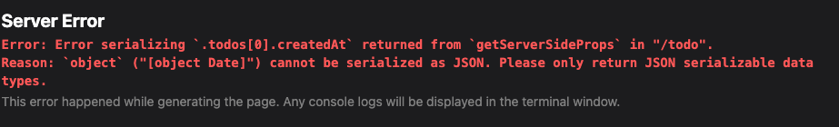

### prismaのメモ

**概要**
- ORMツール
- https://zenn.dev/kanasugi/articles/a082bd39c5bdf2

**型補間**
- マイグレーションすると`@prisma/client`がimportされるっぽい
```
    import { PrismaClient, Prisma } from '@prisma/client'
```

- 型補間の利用
- 勝手に色々作成されている
```
    const prisma = new PrismaClient()
    prisma.<テーブル名>
    Prisma.<テーブル名>CreateInput[]
```

**seeding**
- nextのコンパイラではts-nodeを実行できないっぽい (https://zenn.dev/damono999/articles/bd203095b7b883)

- seedingはinsertでやるべきではない (同じデータが何度も登録される)
- upsertを使えば存在しない場合のみデータを挿入できるが，whereでuniqueキーを指定する必要がある (そうじゃないとupdateができない)

- https://m-shige1979.hatenablog.com/entry/2021/11/20/213051
- https://github.com/prisma/prisma-examples/blob/latest/typescript/graphql/prisma/seed.ts

**PrismaのCRUD**
- https://www.prisma.io/docs/concepts/components/prisma-client/crud

**サーバーサイドでの処理**
- Prisma Clientはクライアントサイドでは動かない?
- SSGならサーバーサイドで実行できそう
- Next APIでも動いた
- 使う場合はnextpageでgetServerSidePropsをやる
- マスターデータはgetServerSidePropsでやらない?

**Date型が扱えない**

- 一度文字列に変換してからオブジェクトに変換すればOK
```
    export const getServerSideProps: GetServerSideProps<{ todos: Todo[] }> = async () => {
        const datas: Todo[] = await prisma.todo.findMany()
        const todos = JSON.parse(JSON.stringify(datas))

        return {
            props: {
                todos: todos
            }
        }
    }
```

**where**
- idで絞れない場合がある
- uniqueキーは大事

**複合キー，複合unique，インデックス**
- @@uniqueとか@@indexで指定できる
- https://zenn.dev/smish0000/articles/f1a6f463417b65